# [GeoGenius](https://jolantadjatlova.github.io/geogenius/)

Developer: Jolanta Djatlova ([jolantadjatlova](https://github.com/jolantadjatlova))

This project represents my first fully interactive JavaScript web application, developed as part of the **Code Institute’s JavaScript Essentials milestone**.

GeoGenius was developed to combine fun and learning through interactive geography quizzes.  
The project demonstrates key JavaScript skills including **API integration**, **DOM manipulation**, and **logic control**.  
I chose this concept to challenge myself to create a dynamic web app that delivers instant feedback and works seamlessly across devices.

## Fully Functional Interactive Quiz Website

A fun, interactive geography quiz game where players can test their knowledge by choosing a difficulty level and answering world geography questions. Built using **HTML, CSS, and JavaScript**.

To view the deployed website click [here](https://jolantadjatlova.github.io/geogenius/).

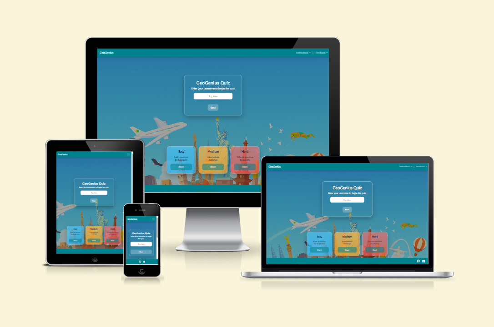 

### Contents

- [UX](#ux)
  - [The 5 Planes of UX](#the-5-planes-of-ux)
    - [1. Strategy](#1-strategy)
    - [2. Scope](#2-scope)
    - [3. Structure](#3-structure)
    - [4. Skeleton](#4-skeleton)
    - [5. Surface](#5-surface)
  - [User Goals](#user-goals)
  - [User Stories](#user-stories)
- [Agile Development Process](#agile-development-process)
  - [Planning Tools & Workflow](#planning-tools--workflow)
    - [GitHub Projects (Kanban)](#github-projects-kanban)
    - [GitHub Issues](#github-issues)
    - [MoSCoW Prioritization](#moscow-prioritization)
  - [Images](#images)
  - [Responsiveness](#responsiveness)
- [Features](#features)
  - [Existing Features](#existing-features)
  - [Future Enhancements](#future-enhancements)
- [Technologies Used](#technologies-used)
- [Testing](#testing)
  - [Bugs](#bugs)
  - [Responsiveness Test](#responsiveness-test)
  - [Code Validation](#code-validation)
    - [HTML](#html)
    - [CSS](#css)
    - [JavaScript](#javascript)
  - [User Story Testing](#user-story-testing)
  - [Form Validation Testing](#form-validation-testing)
  - [Lighthouse Testing](#lighthouse-testing)
  - [Browser Testing](#browser-testing)
- [Deployment](#deployment)
  - [To Deploy the Project](#to-deploy-the-project)
  - [To Fork the Project](#to-fork-the-project)
  - [To Clone the Project](#to-clone-the-project)
- [Credits](#credits)
  - [Feedback, Advice and Support](#feedback-advice-and-support)
  - [Learning Help and Resources](#learning-help-and-resources)
  - [Images](#images-1)
- [Final Tidy-Up](#final-tidy-up)

## UX
### The 5 Planes of UX

#### 1. Strategy

**Purpose**

- Provide an educational yet entertaining quiz for users to test and expand their geography knowledge.

- Deliver quick, replayable gameplay suitable for short study breaks or casual learning.

- Encourage engagement through instant feedback, multiple difficulty levels, and score tracking.

- Offer a polished, accessible interface that makes learning feel rewarding and fun.

**Primary User Needs**

- Quickly understand how to play without needing lengthy instructions.

- Easily choose a difficulty level (Easy, Medium, Hard).

- Receive clear visual feedback for correct and incorrect answers.

- Track progress and performance (score, high scores, results).

- Access the quiz seamlessly on mobile, tablet, or desktop.

- Use a simple feedback form to share opinions or report issues.

**Business/Project Goals**

- Showcase a fully functional JavaScript project demonstrating skills in DOM manipulation, conditionals, arrays, timers, and local storage.

- Implement UX best practices including accessibility (aria attributes, keyboard navigation, responsive design).

- Apply Bootstrap for consistency and efficient responsive layout.

- Create a visually engaging, interactive quiz that could serve educational or recreational purposes.

[Back to contents](#contents)

#### 2. Scope

**Functional Requirements**

- User can enter a username and save it for the session (stored in localStorage).

- User can select from three difficulty levels: Easy, Medium, Hard.

- The quiz fetches questions dynamically from the Open Trivia Database API.

- Each question presents four possible answers (one correct).

- The timer counts down from 20 seconds per question.

- Visual feedback (correct/wrong color) is given instantly after each answer.

- Final score and personalized message are displayed on completion.

- A leaderboard stores the top five high scores locally.

- “Play Again” resets the quiz for a new attempt.

- Feedback form and instructions are accessible via the navigation bar.

**Content Requirements**

- Quiz title, username input, and difficulty descriptions.

- Questions and answers from API data.

- User feedback messages (“Congratulations!” / “Keep trying!”).

- Accessible text labels, aria roles, and color-coded states.

- Iconography for visual reinforcement (✔️ / ❌ / ⏱️).

#### 3. Structure

**Interaction Design**

- The user journey follows a simple linear flow:  
  1. Enter username  
  2. Select difficulty  
  3. Answer timed questions  
  4. View results and leaderboard  
  5. Play again if desired  
- Each step provides instant visual feedback.  
- Questions automatically advance for a smooth, continuous experience.  

**Information Architecture**

- Distinct sections for each stage: *Hero (Start)*, *Quiz*, and *Results*.  
- The navigation bar gives consistent access to *Instructions* and *Feedback*.  
- Layout built using Bootstrap’s grid and flex utilities.  
- Quiz data and scores are stored in memory and persisted in `localStorage`.  

**Navigation Layout**

- A fixed Bootstrap navbar provides quick access to:  
  - **Instructions** (how to play)  
  - **Feedback Form** (user input)  
  - **Home** (GeoGenius title link)  
- The navbar collapses into a mobile-friendly burger menu on smaller screens.  

**User Flow**

1. User lands on the homepage and sees the GeoGenius title and username input.  
2. User saves their name and selects a difficulty level (Easy, Medium, Hard).  
3. The quiz begins with timed multiple-choice questions.  
4. After each answer, visual feedback appears (green/red highlights).  
5. After all questions, the results screen shows the score and leaderboard.  
6. User can submit feedback or start a new quiz. 

#### 4. Skeleton

**Wireframes** 

Wireframes were created using [Balsamiq](https://balsamiq.com/) to map out the layout for mobile, tablet and desktop screens.

#### 5. Surface

**Visual Design**

- Color palette inspired by geography and learning — cool blues with bright accent tones.  
- Glassmorphism cards add modern depth and focus.  
- Font Awesome icons enhance clarity without visual clutter.  
- Smooth animations (spinner, transitions) improve engagement.  
- Consistent typography using the **Outfit** font for a clean and readable look.  

**Typography**

- The **Outfit** typeface is used throughout the interface for a modern and approachable appearance.  
- Chosen for its clarity and rounded geometry, it ensures text remains legible across all screen sizes.  
- Font weights (400, 600, 700) establish visual hierarchy between headings, buttons, and body text.  
- The consistent type styling complements the educational and friendly tone of the quiz.

**Colour Scheme**

The colour palette was designed using [Coolors](https://coolors.co/), inspired by the quiz’s hero images and the educational theme.  
It combines soft blues and neutrals to create a calm, focused environment for users.  

**Contrast Grid**

A contrast grid was used to ensure that text and interactive elements meet accessibility guidelines for contrast and readability across all device types.  

**Responsiveness**

- The layout was designed for desktop and tablet first, then adjusted for smaller screens using max-width media queries.

- Ensures all content remains clear, accessible, and visually balanced across all device sizes. 

**Accessibility**

- High colour contrast for legibility.  
- `aria-live` and `role="status"` attributes ensure updates are announced to assistive technology.  
- Fully keyboard navigable with visible focus states.  
- Clear error messaging and validation for username input. 

[Back to contents](#contents)

## User Goals

- User-friendly navigation and layout.  
- Non-distracting, visually clear background.  
- Opportunity to provide quick feedback via a simple form.  
- Clear instructions written in plain English.  
- Relevant and varied geography questions.  
- Fair and transparent scoring system.  
- Ability to easily replay the quiz or change difficulty levels.  

## User Stories

- As a user, I want to enter my username before starting, so my score feels personal.  
- As a user, I want to choose **Easy**, **Medium**, or **Hard** so the questions suit my ability.  
- As a user, I want to find **clear instructions** or send **feedback** easily.    
- As a user, I want to see my **final score** when the quiz ends.  
- As a user, I want the game to show a **leaderboard** of the top scores, so I can see how my score compares to others.  
- As a user, I want to see **how far through the quiz** I am.  
- As a user, I want the quiz to work **smoothly on any device**.  
- As a user, I want to click an answer and know **immediately if I was right or wrong**.  

## Agile Development Process

The **GeoGenius** quiz was developed using an **iterative Agile approach**, focusing on building a clear, user-friendly **Minimum Viable Product (MVP)**.  
The workflow was managed through **GitHub Projects** (Kanban board) and **GitHub Issues**, where each user story was assigned a priority using the **MoSCoW** method.  

This ensured that the most essential functionality—such as dynamic question loading, scoring, and responsive design—was developed first, followed by enhancements like the leaderboard and feedback form.

The scope and requirements of the project are detailed in the [5 Planes of UX](#the-5-planes-of-ux) section.

### Planning Tools & Workflow

To stay organised and follow an iterative Agile process, I used the following tools throughout the development of **GeoGenius**:

---

#### GitHub Projects (Kanban)

A **Kanban board** was set up in [GitHub Projects](https://github.com/users/jolantadjatlova/projects/8) to manage all tasks visually.  
Tasks were broken down into **user stories** and categorised by status:  
**To Do → In Progress → Done**

This helped me:

- Track progress easily  
- Stay focused on achievable goals  
- Maintain momentum without feeling overwhelmed  

---

#### GitHub Issues

[GitHub Issues](https://github.com/jolantadjatlova/geogenius/issues) were used to:

- Document **user stories** and **tasks**  
- Break down larger goals into manageable steps  
- Track development progress for key features  

Each issue was assigned a **priority label** using the **MoSCoW method**  
(e.g., *must-have*, *should-have*, *could-have*)  
to help focus on what was most essential for the MVP.

[Back to contents](#contents)

### MoSCoW Prioritization

To prioritize tasks effectively, I applied the **MoSCoW method**:

| **Priority** | **Description** |
|---------------|-----------------|
| **Must Have** | Core quiz functionality including username input, difficulty selection, API question fetch, timer, and scoring system. These features are essential for the quiz to function correctly. |
| **Should Have** | Features that enhance the user experience such as the high score leaderboard (localStorage), responsive design adjustments, and clear feedback/instructions. |
| **Could Have** | Nice-to-have additions like sound effects, improved loading animations, or expanded quiz categories if time allows. |

This ensured a **focused, realistic development process** that stayed aligned with the project’s goals and user needs.

---
[Back to contents](#contents)
                                   
### Images

The background image for GeoGenius were generated using **ChatGPT**.  
It depicts a bright blue sky with global landmarks such as the Eiffel Tower, Big Ben, the Statue of Liberty, and Christ the Redeemer — reflecting the quiz’s geographical theme. 

The playful illustration style with planes, birds, and hot-air balloons adds an educational yet fun atmosphere, while keeping the focus on the quiz interface.  
The image was intentionally designed to be light and non-distracting, ensuring readability of the text and buttons.

### Responsiveness

The GeoGenius website adapts seamlessly to different screen sizes using custom CSS media queries.  
The layout, typography, and interactive elements dynamically adjust to ensure usability and visual balance across **mobile**, **tablet**, and **desktop** devices.  

- All buttons, inputs, and quiz cards remain accessible and easy to tap on smaller screens.  
- Text and visual components maintain clarity without overflow or layout shift.  
- Navigation collapses into a hamburger menu for smaller devices, improving accessibility and focus.  

To view detailed responsiveness results, see the [Responsiveness Test](#responsiveness-test).

# Features

GeoGenius provides a clean, structured, and intuitive layout that makes navigation simple on any device.  
Players can easily start a quiz, change difficulty levels, and access helpful features such as **Instructions**, **Feedback**, and **High Scores**.  
With timed multiple-choice questions, instant right-or-wrong feedback, and visually clear progress tracking, the quiz offers an engaging and educational experience.  
These interactive elements encourage users to test their knowledge repeatedly while improving their geography skills in a fun and motivating way.

## Existing Features

### Navbar

A single, responsive, sticky navbar is used across the entire site.  
It displays the **GeoGenius** brand on the left and two dropdown controls on the right: **Instructions** and **Feedback**.  
On smaller screens, the same navbar collapses into a hamburger menu using Bootstrap’s built-in responsive behavior.

<b>Navbar View</b>

 

- **Instructions** — Opens a concise, step-by-step guide in a dropdown.  
- **Feedback** — Opens a small contact form that collects **Name**, **Email**, and **Message**.  
  All fields are required and validated by the browser.  
  On successful submission, users see a confirmation message on a separate page (`success.html`).

---

### Landing View

The quiz is a single-page web app optimized for quick performance.  
The landing area includes:

- The quiz title (**GeoGenius Quiz**)
- A **username** input and **Save** button
- Three **difficulty level cards**: Easy, Medium, and Hard

All buttons feature hover effects, and the active difficulty card highlights clearly.  
Both the **username** and a **difficulty level** must be set to begin.  
Once confirmed, the app fetches 10 geography questions from **Open Trivia DB** based on the chosen difficulty.

<b>Landing View</b>

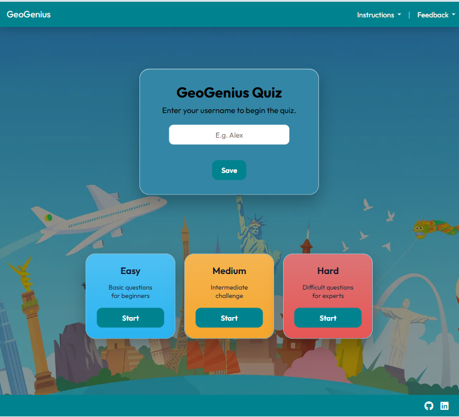

 

---

### Question View

Each quiz question is multiple choice and displayed one at a time with four possible answers.  

**Features include:**
- A **20-second countdown timer** per question  
- Automatic skip when time runs out  
- Correct answers highlighted in **green**, incorrect in **red**  
- A **progress tracker** showing question number (e.g., `Q3/10`)  
- A **score summary** that updates live (✔️ correct / ❌ wrong)

<b>Question View</b>

 

---

### Final Score View

After the last question, the app displays the player’s results:  
a personalized message with the username, the final score, and total questions answered.

Two buttons appear:

- **Play Again** — Resets the game and returns to the landing screen.  
- **High Scores** — Toggles the leaderboard of saved scores.

<b>Final Score View</b>

 

---

### High Score

The app saves the **Top 5** scores locally using the browser’s `localStorage`.  
Players can toggle the leaderboard open or closed with the **High Scores** button to view recent results.  
This helps users track progress and encourages replayability.

<b>Player Scores View</b>

 

---

### Footer

A clean, minimalist footer continues the cool-toned theme and includes two icons:  
**GitHub** and **LinkedIn**, both opening in new tabs.  
Icons have hover effects for improved user experience.

<b>Footer</b>

 

---

### Loader

While questions are being fetched from **Open Trivia DB**, a small animated spinner appears inside the quiz card.  
This prevents the question area from appearing empty.  
If the API fails to respond, a friendly error message prompts the user to retry.

<b>Loader</b>

 

### 404 Page

A custom **404 error page** ensures a smooth experience if the user visits a broken or invalid link.  
It displays a friendly themed message — *“Wrong Coordinates!”* — keeping with the geography and travel style of the site.

The page automatically **redirects back to the homepage** after a short countdown, handled by a small JavaScript file (`redirect.js`).  
A **Navigate Home** button also allows users to manually return immediately.

Both the **navbar** and **footer** are consistent with the rest of the site, maintaining brand continuity and accessibility.

<b>404 Page View</b>

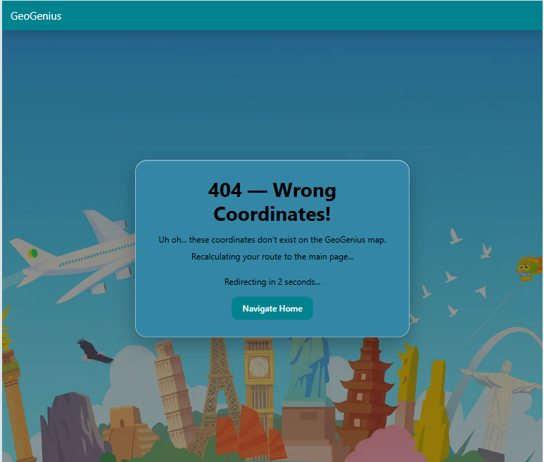

 

[Back to contents](#contents)

### Future Enhancements

- **Add sound effects** for correct and wrong answers to make gameplay more engaging.  
- **Introduce quiz categories** (e.g., capitals, landmarks, flags) so players can choose specific topics.  
- **Include global leaderboard** using a backend database to compare scores between users.  
- **Add progress dots or bar** under the timer to visualize answered questions.   
- **Add more animations** (e.g., confetti or fade transitions) for correct answers and final results.    

## Technologies Used

| Technology | Purpose | Type |
|-------------|----------|------|
| [Git](https://git-scm.com/) | Track changes and manage code history. | Tool |
| [GitHub](https://github.com/) | Store and share the project repository. | Tool |
| [VS Code](https://code.visualstudio.com/) | Writing and organizing all project files. | Tool |
| [HTML](https://developer.mozilla.org/en-US/docs/Web/HTML) | Build the structure and layout of the website. | Language |
| [CSS](https://developer.mozilla.org/en-US/docs/Web/CSS) | Design and style visual elements for the user interface. | Language |
| [JavaScript](https://developer.mozilla.org/en-US/docs/Web/JavaScript) | Add interactivity, logic, and quiz functionality (timers, feedback, scoring, API integration). | Language |
| [Bootstrap](https://getbootstrap.com/) | Assist with layout structure and responsive grid system. | Library |
| [Am I Responsive](https://ui.dev/amiresponsive) | Preview how the website looks on multiple device screens. | Tool |
| [Balsamiq](https://balsamiq.com/) | Create wireframes for mobile, tablet, and desktop layouts. | Tool |
| [Coolors](https://coolors.co/) | Generate the project’s colour palette. | Tool |
| [Eight Shapes Contrast Grid](https://contrast-grid.eightshapes.com/) | Test color contrast and accessibility combinations. | Tool |
| [Pixlr](https://pixlr.com/) | Resize and optimize images for web performance. | Tool |
| [Favicon.io](https://favicon.io/) | Generate custom favicon for the website. | Tool |
| [Google Fonts](https://fonts.google.com/) | Import and apply the **Outfit** font for readability. | Library |
| [Font Awesome](https://fontawesome.com/) | Add visual icons and enhance user experience. | Library |
| [ChatGPT](https://chat.openai.com/) | Assisted in writing content and refining code structure. | AI |
| [Markdown Table Generator](https://www.tablesgenerator.com/markdown_tables) | Helped generate and format markdown tables. | Tool |
| [W3C HTML Validation Service](https://validator.w3.org/) | Validate HTML syntax and structure. | Tool |
| [W3C CSS Validation Service](https://jigsaw.w3.org/css-validator/) | Validate CSS syntax and detect errors. | Tool |
| [JSHint](https://jshint.com/) | Validate JavaScript syntax and code quality. | Tool |
   
[Back to contents](#contents)

# Testing
## Bugs

| **Bug** | **Status** | **Description** | **Steps to Resolve** |
|----------|-------------|-----------------|----------------------|
| Timer keeps running after game | Fixed | The countdown continued after the results screen and sometimes into a new game. | Centralized `stopTimer()` on every screen change; start timer only in `renderQuestion()`. |
| Feedback validation message not showing | Fixed | Validation warning didn’t appear because the dropdown closed automatically before showing it. | Made the Feedback dropdown stay open until manually closed, allowing the warning to display correctly. |
| Correct answer not highlighted | Fixed | Sometimes the right answer didn’t turn green after selection. | Cleared all button styles before each question and ensured the correct button always gets the green highlight. |

## Responsiveness Test

I've tested my deployed project on different devices and screen sizes to ensure that all pages display correctly and remain fully functional.

| **Page** | **Mobile** | **Tablet** | **Desktop** | **Notes** |
|-----------|-------------|-------------|--------------|------------|
| **Home / Landing** |  |  |  | Works as expected |
| **Quiz View** |  |  |  | Works as expected |
| **Final Score** |  |  |  | Works as expected |
| **High Scores** |  |  |  | Works as expected |
| **Feedback Form** |  |  |  | Works as expected |
| **Success Page** |  |  | 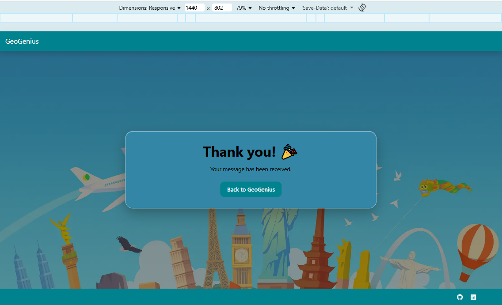 | Works as expected |
| **404 Page** |  |  |  | Works as expected |
| **Instructions Dropdown** |  | 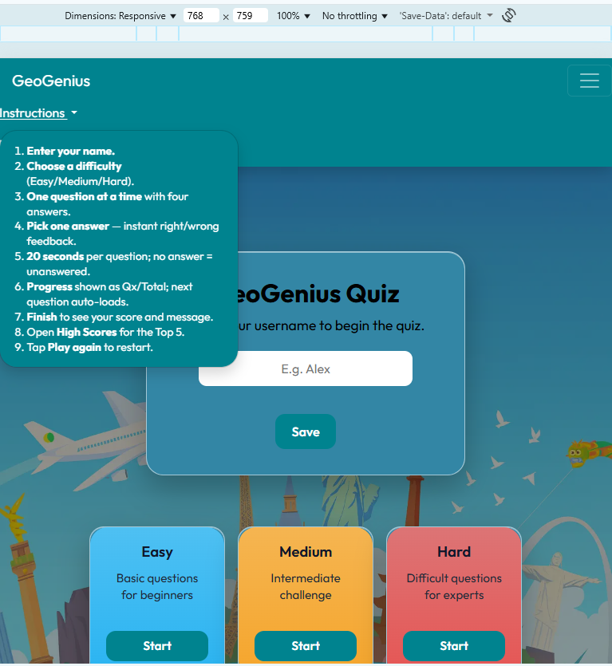 |  | Works as expected |

---
## Code Validation

### HTML
I used the [W3C HTML Validation Service](https://validator.w3.org/) to check all HTML files in the project.  
All pages returned **no errors or warnings**, confirming that the HTML is valid and well-structured.

- **Main Page (index.html):**  

  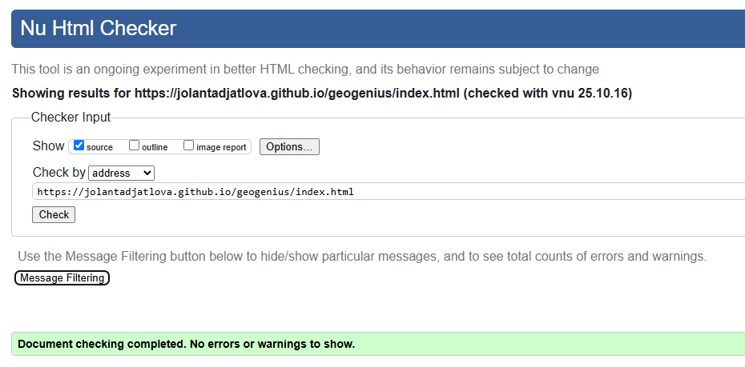

- **Success Page (success.html):**  

  

- **404 Page (404.html):**  

  

### CSS

The stylesheet was tested using the [W3C CSS Validation Service](https://jigsaw.w3.org/css-validator/).  
The result showed **no errors**, confirming that the CSS file follows current web standards.

### JavaScript

JavaScript files were tested using the [JSHint](https://jshint.com/) validation tool to ensure code quality and compliance with ECMAScript 11 standards.

Both scripts passed validation successfully.  

- **Main Script (`script.js`):**  
  

- **Redirect Script (`redirect.js`):**  
  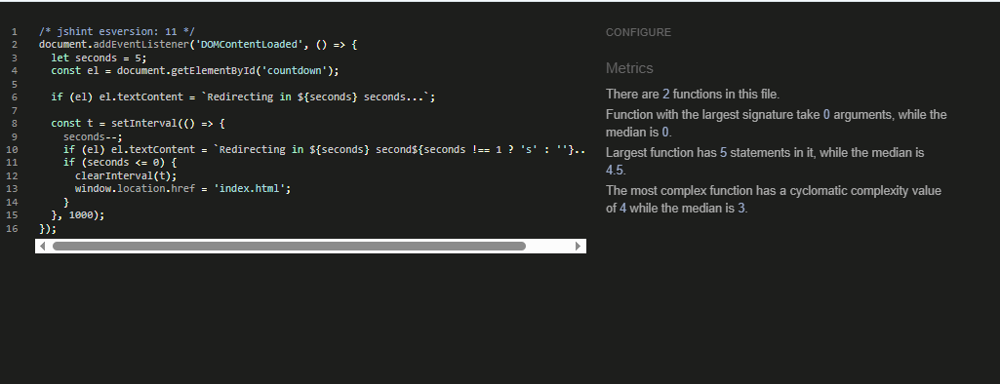

[Back to contents](#contents)

## User Story Testing

| User Story                                                                               | Result                                                                    | Pass | Screenshot                                                |
| ---------------------------------------------------------------------------------------- | ------------------------------------------------------------------------- | ---- | --------------------------------------------------------- |
| As a user, I want to enter my username before starting, so my score feels personal.      | User can input their name before starting, and it appears in the results. | Yes  | [Username Input](docs/user-story1.png "Username Input")   |
| As a user, I want to choose Easy, Medium, or Hard so the questions suit my ability.      | User can select one of three difficulty levels before the quiz begins.    | Yes  | [Level Selection](docs/user-story2.png "Level Selection") |
| As a user, I want to see how far through the quiz I am.                                  | Progress indicator updates after each question.                           | Yes  | [Progress Indicator](docs/user-story3.png "Progress Indicator") |
| As a user, I want to click an answer and know if I was right or wrong immediately.       | Buttons turn green/red instantly after selection.                         | Yes  | [Answer Feedback](docs/user-story4.png "Answer Feedback") |
| As a user, I want to see my final score when the quiz ends.                              | End screen shows total score and result message.                          | Yes  | [Results Screen](docs/user-story5.png "Results Screen")   |
| As a user, I want the game to show a leaderboard of the top scores, so I can compare.    | Leaderboard displays top five saved scores via local storage.             | Yes  | [Leaderboard View](docs/user-story6.png "Leaderboard View") |
| As a user, I want to read clear instructions on how to play the GeoGenius quiz, so I know what to do before starting. | Instructions dropdown in navbar explains rules in plain English.          | Yes  | [Instructions Menu](docs/user-story8.png "Instructions Menu") |
| As a user, I want to send feedback or suggestions to the GeoGenius developers, so I can share my thoughts or report issues. | Feedback form in navbar allows name, email, and message submission.       | Yes  | [Feedback Form](docs/user-story7.png "Feedback Form")     |
| As a user, I want the quiz to work smoothly on any device.                               | Fully responsive design confirmed through device testing.                 | Yes  | [Responsive View](docs/user-story9.png "Responsive View") |

---
## Form Validation Testing

The **GeoGenius** website contains two forms that require input validation:

1. **Username input** on the landing page — ensures players enter a valid name before starting the quiz.  
2. **Feedback form** in the navigation bar — ensures all required fields are completed with valid data before submission.

Both forms rely on built-in HTML5 validation and custom JavaScript error handling for clear, user-friendly feedback.

| **Field** | **Expected Behavior** | **Tested Input** | **Result** | **Evidence** |
|------------|------------------------|------------------|-------------|---------------|
| **Username** | Required. Must not accept empty input. | Left empty | Submission blocked. Inline browser message: *"Please fill out this field."* |  |
| **Username** | Minimum 2 characters required. | One character entered ("A") | Custom error displayed below field: *"Please enter at least 2 characters."* |  |
| **Username** | Valid input (≥2 characters). | "jolanta" | Message *"Saved ✓"* shown. Name stored in localStorage. |  |
| **Feedback – Name** | Required. Must not accept empty input. | Left empty | Submission blocked. Inline browser message: *"Please fill in this field."* | 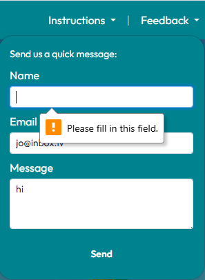 |
| **Feedback – Email** | Required. Must not accept empty input. | Left empty | Submission blocked. Inline browser message: *"Please fill in this field."* |  |
| **Feedback – Email** | Must include a valid “@” symbol. | "jo" | Inline browser message: *"Please include an '@' in the email address."* |  |
| **Feedback – Message** | Required. Must not accept empty input. | Left empty | Submission blocked. Inline browser message: *"Please fill in this field."* |  |

---

### Lighthouse Testing 

GeoGenius was tested using **Chrome DevTools Lighthouse** to evaluate overall site quality across multiple key areas.  
This tool inspects and scores the website for the following criteria:

- **Performance** – measures how fast the website loads and responds.  
- **Accessibility** – evaluates how well users, including those using assistive technologies, can navigate the site.  
- **Best Practices** – checks if the site follows modern web development standards.  
- **SEO** – tests how well the site follows search engine optimization guidelines to ensure discoverability.

---

**Test for Mobile:** 

**Test for Desktop:**  

## Browser Testing

Tested on **Google Chrome**, **Mozilla Firefox**, and **Microsoft Edge** on desktop.  

| **Page** | **Chrome** | **Firefox** | **Microsoft Edge** | **Notes** |
|---|---|---|---|---|
| **Home / Landing** |  | 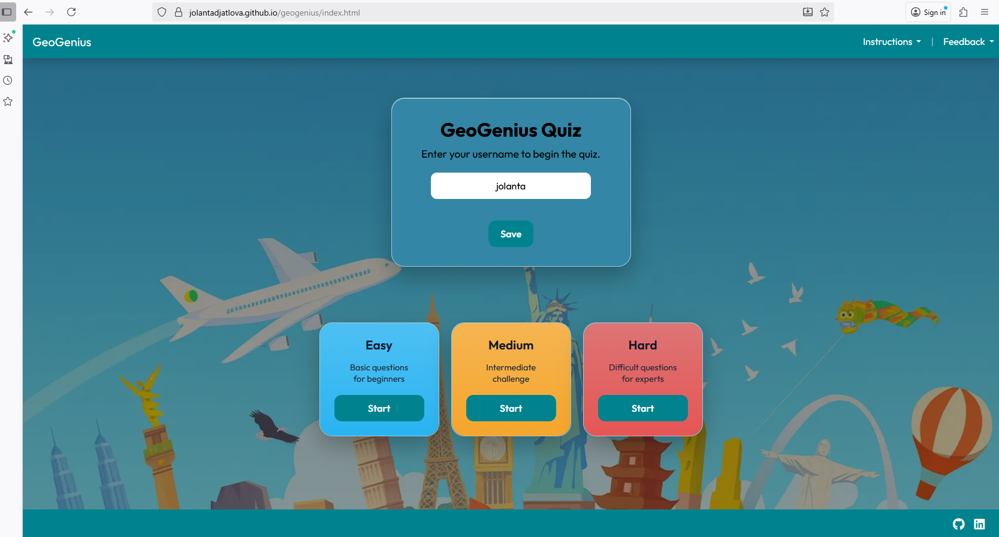 |  | Works as expected |
| **Instructions Dropdown** |  |  |  | Works as expected |
| **Quiz View** |  |  |  | Works as expected |
| **Final Score** |  |  |  | Works as expected |
| **High Scores** |  |  |  | Works as expected |
| **Feedback Form** |  |  |  | Works as expected |
| **Success Page** | 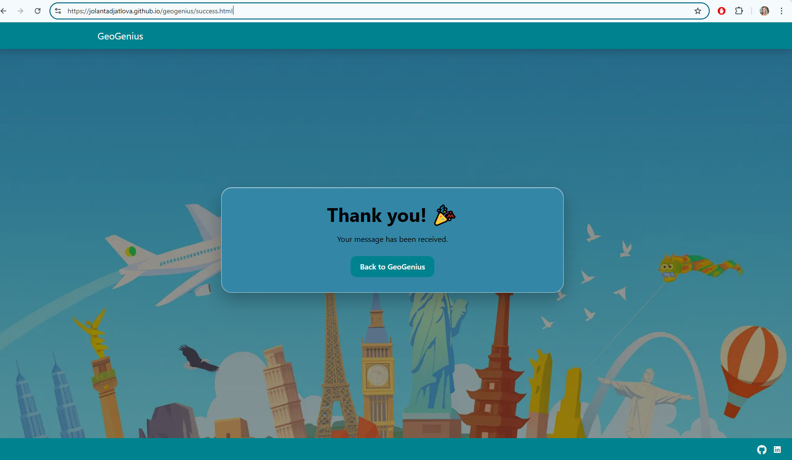 |  | 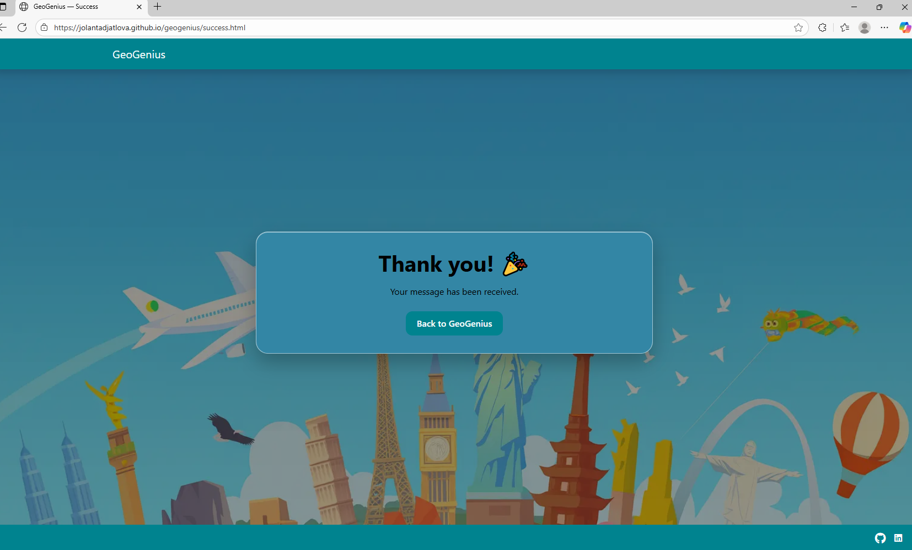 | Works as expected |
| **404 Page** | 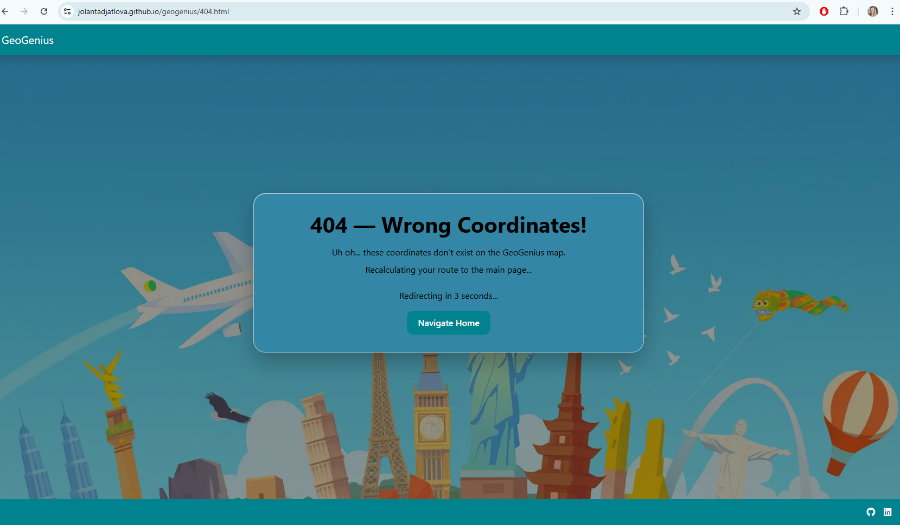 |  | 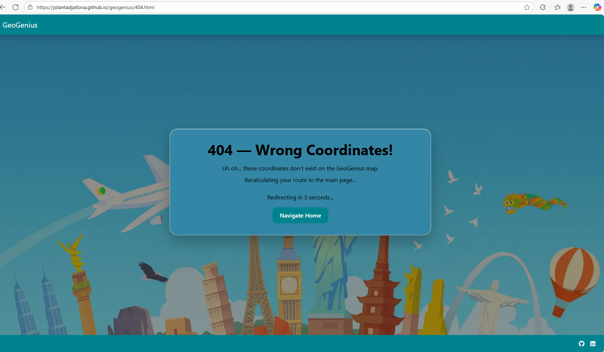 | Works as expected |

---
[Back to contents](#contents)

# Deployment

## To deploy the project

The **GeoGenius** website was deployed using **GitHub Pages**.  

To deploy the project:
- Log in to GitHub and navigate to the repository.
- Click on the **Settings** tab in the navigation bar at the top of the repository.
- In the **Code and Automation** section of the sidebar, select **Pages**.
- Under **Source**, choose **Deploy from a branch**.
- In the **Branch** dropdown, select **main**, then click **Save**.
- GitHub will automatically build and deploy the site.  
   Once published, the live link will appear at the top of the **Pages** section.

You can view the deployed site here:  
🔗 [https://jolantadjatlova.github.io/geogenius/](https://jolantadjatlova.github.io/geogenius/)

## To fork the project

Forking the GitHub repository allows you to create a duplicate of a local repository. This is done so that modifications to the copy can be performed without compromising the original repository.

- Log in to GitHub.
- Locate the repository.
- Click to open it.
- The fork button is located on the right side of the repository menu.
- To copy the repository to your GitHub account, click the button.

## To clone the project

- Log in to GitHub.
- Navigate to the main page of the repository and click Code.
- Copy the URL for the repository.
- Open your local IDE.
- Change the current working directory to the location where you want the cloned directory.
- Type git clone, and then paste the URL you copied earlier.
- Press Enter to create your local clone.

# Credits

#### Feedback, Advice, and Support

- [Simen Daehlin](https://github.com/Eventyret "Simen Daehlin") – Code Institute mentor, for continuous support, detailed feedback, and invaluable guidance throughout the project’s development.  
- [Rory Patrick Sheridan](https://github.com/Ri-Dearg "Rory Patrick Sheridan") – Code Institute mentor, for constructive feedback and helpful insights during the project’s milestone reviews and final assessment.  

#### Learning Help and Resources

- [Code Institute](https://codeinstitute.net/) course material and walkthrough projects.  
- [MDN Web Docs](https://developer.mozilla.org/) – for official HTML, CSS, and JavaScript references and examples.  
- [Stack Overflow](https://stackoverflow.com/) – for troubleshooting and community support.  
- [W3Schools](https://www.w3schools.com/) – for additional syntax and styling resources.
- **ChatGPT** – used as a supportive tool to clarify coding concepts, structure documentation (README), and refine explanations or error messages during development.

#### Images

- The hero background image was generated using **ChatGPT image tools**, representing global landmarks and travel imagery in a light, educational style.
- All icons provided by **Font Awesome**.

# Final Tidy-Up

Before submitting, I carefully reviewed and refined all elements of the **GeoGenius** project to ensure it met the Code Institute assessment standards.  
This included final validation of all code, accessibility checks, and thorough proofreading of the README and documentation.  

Through this project, I strengthened my understanding of:
- JavaScript interactivity and DOM manipulation  
- API integration and dynamic content handling  
- Accessibility principles and responsive design  
- Agile development practices using GitHub Projects and Issues  

This project intentionally keeps one non-fatal console message:

- `console.warn("API failed:", e);` — used to surface API or network issues during testing without breaking the user flow.  

All other temporary debug logs were removed prior to submission to keep the console clean and professional.

Building **GeoGenius** deepened my confidence in front-end web development and my ability to create engaging, user-focused digital experiences.

[Back to contents](#contents)